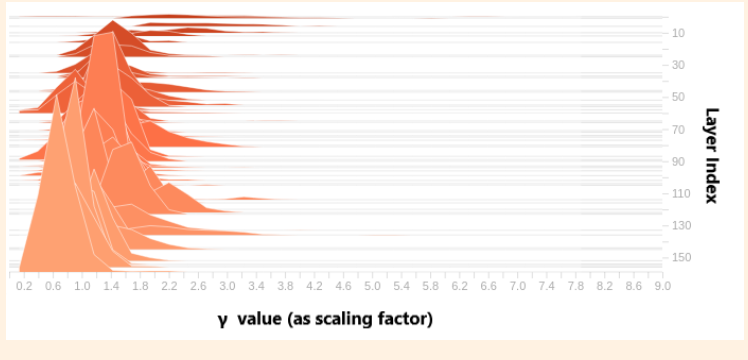
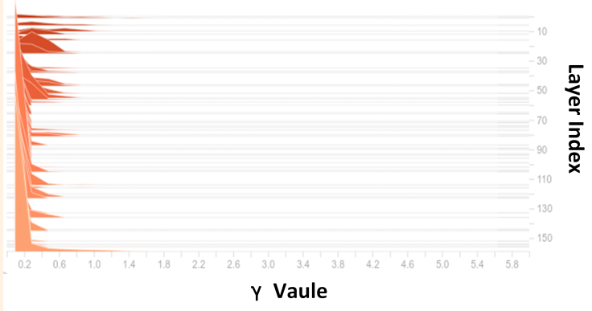
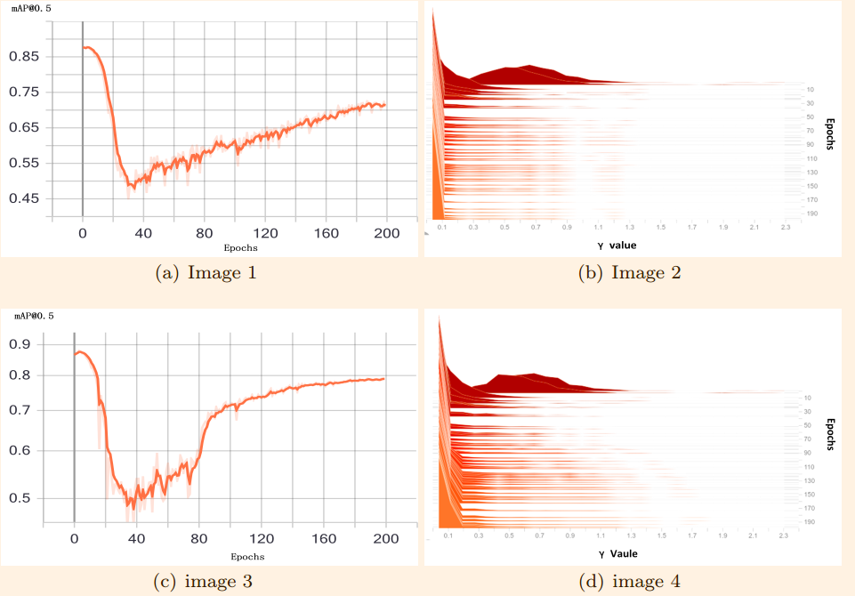

# Model_Compression_For_YOLOV4
In this  repository  using the dynamic sparse training( variable sparse rate s which can speed up the sparse training process), channel pruning and  knowledge distilling for  YOLOV3 and YOLOV4;

Here is our paper [Group channel pruning and spatial attention distilling for object detection](https://link.springer.com/article/10.1007/s10489-022-03293-x)


# YOLOv3v4 -ModelCompression-Training

This repository  project mainly include three parts.

Part1.  Common training and sparse training(prepare for the channel pruning) for object detection datasets(COCO2017, VOC, OxforHand).

Part2.  General model compression algorithm including pruning and knowledge distillation.

Part3.  A brief introduce for Network quantization .

Source code using Pytorch implementation to [ultralytics/yolov3](https://github.com/ultralytics/yolov3) for yolov3 source code.

For the  YOLOV4 pytorch version, try this https://github.com/Tianxiaomo/pytorch-YOLOv4.


### Datasets and  Environment Requirements
Make a COCO or VOC dataset for this project try here [dataset_for_Ultralytics_training](https://github.com/chumingqian/Make_Dataset-for-Ultralytics-yolov3v4).

The environment is Pytorch >= 1.1.0 , see the ./requiremnts.txt and also can reference the [ultralytics/yolov3](https://github.com/ultralytics/yolov3) ./requirements.txt .

---------
  
###  Part1.Common training and sparse training(prepare for the channel pruning)  for object detection datasets

#### 1.1 For the common training use the following command: 

   `python3 train.py --data ...  --cfg ...  -pt  --weights ...  --img_size ... --batch-size ... --epochs  ... ` :
      ` -pt means that will  use the pretrained  model's weight`.

#### 1.2 For the sparse training use the:
```bash
python3 train.py --data ... -sr --s 0.001 --prune 0  -pt --weights ... --cfg ... --img_size ...  --batch-size 32  --epochs ...
```

#### 1.3 parameter explaination:

`-sr`: Sparse training,`--s`: Specifies the sparsity factor，`--prune` :Specify the sparsity type.

`--prune 0` is the sparsity of normal pruning and regular pruning.

`--prune 1` is the sparsity of shortcut pruning.

`--prune 2` is the sparsity of layer pruning.

-`details see the 2.1`.


#### 1.4 Notice for the sparse training:

-The reason for using sparse training before we prune the network is that we need to select out the unimportant channels in the network, through the sparse training we can select out and prune  these unimportant channels in the network.
    
-When the classes you trian network is not too much, such 1-5 classes. There maybe  no difference with sparse training or without sparse training before prune the network.
  
-When the training classes are above 10 clasees, sparse training  play an important role,  in this situation  prune the channel directly  without sparse training  will  bring an irreparable damage to the network's accuracy, even later use the fine-tune  or distillation it brings  a little effect.   Meanwhile, doing the sparse training firstly,  then prune the network it may reduce the network's accuracy  temporary, after we fine-tune or distilling the pruned  network,  the pruned network's accuracy will be regained.
   
   
```bash
python3 train.py --data ... -sr --s 0.001 --prune 0  -pt --weights ... --cfg ... --img_size ...  --batch-size 32  --epochs ...
```


#### 1.5  The original weights  distribution  and  sparse training weights distribution


<div align="center">
   
   <div style="color:orange; border-bottom: 1px solid #d9d9d9;
    display: inline-block;
    color: #999;
    padding: 2px;"
    > Fig1: left- the original weight distribution  right: the weight distribution after sprse training </div>
</div>

<br>


<center>
     
    <div style="color:orange; border-bottom: 1px solid #d9d9d9;
    display: inline-block;
    color: #999;
    padding: 2px;"
    > Fig2: The mAP during the  sparse training on the VOC dataset </div>
    <br>
</center>


  

#### 1.6 Testing and detect command:

`python3 test.py --data ... --cfg ... `: Test the mAP@0.5 command

`python3 detect.py --data ... --cfg ... --source ...`: Detection a single image/video command, default address of source is data/samples, the output result is saved in the output file.

-------


### Part2 Model compression algorithm including pruning and knowledge distillation.

#### 2.1 channel pruning types 
|<center>method</center> |<center>advantage</center>|<center>disadvantage</center> |
| --- | --- | --- |
|Normal pruning        |Not prune for shortcut layer. It has a considerable and stable compression rate that requires no fine tuning.|The compression rate is not extreme.  |
|Shortcut pruning      |Very high compression rate.  |Fine-tuning is necessary.  |
|Silmming              |Shortcut fusion method was used to improve the precision of shear planting.|Best way for shortcut pruning|
|Regular pruning       |Designed for hardware deployment, the number of filters after pruning is a multiple of 2, no fine-tuning, support tiny-yolov3 and Mobilenet series.|Part of the compression ratio is sacrificed for regularization. |
|layer pruning         |ResBlock is used as the basic unit for purning, which is conducive to hardware deployment. |It can only cut backbone. |
|layer-channel pruning |First, use channel pruning and then use layer pruning, and pruning rate was very high. |Accuracy may be affected. |

#### 2.2  Pruning the network command:

-for the  channel pruning  types:
```bash
python3 normal(or regular/shortcut/slim)_prune.py --cfg ... --data ... --weights ... --percent ...
```

-for the layer pruning(it is actually based on the channel pruning):
```bash
python3 layer_prune.py --cfg ... --data ... --weights ... --shortcut ...

python3 layer_channel_prune.py --cfg ... --data ... --weights ... --shortcut ... --percent ...
```

-Notice that we can get more compression by increasing the percent value, but if the sparsity is not enough and the percent value is too high, the program will report an error.


#### 2.3 Network  Knowledge  distillation:


##### 2.3.1 Important Notice 
- For the pruned model,  we can fine tune 20~ 50 epochs to recover the pruned model's accuracy!
- After that we use the pruned and fine-tuned model  as student network, the original network(before sparse training ) to do the  knowledge distillation.


-The basic distillation method [Distilling the Knowledge in a Neural Network](https://arxiv.org/abs/1503.02531) was proposed by Hinton in 2015, and has been partially improved in combination with the detection network.

#### 2.4 Knowledge  distillation command, add the `--t_cfg --t_weights --KDstr`  choice:

```bash
python train.py --data ... --batch-size ... --weights ... --cfg ... --img-size ... --epochs ... --t_cfg ... --t_weights ...
```
 
`--t_cfg` :cfg file of teacher model   `--t_weights`: weights file of teacher model    `--KDstr` :KD strategy


    `--KDstr 1` KLloss can be obtained directly from the output of teacher network and the output of student network and added to the overall loss.
    `--KDstr 2` To distinguish between box loss and class loss, the student does not learn directly from the teacher. L2 distance is calculated respectively for student, teacher and GT. When student is greater than teacher, an additional loss is added for student and GT.
    `--KDstr 3` To distinguish between Boxloss and ClassLoss, the student learns directly from the teacher.
    `--KDstr 4` KDloss is divided into three categories, box loss, class loss and feature loss.
    `--KDstr 5` On the basis of KDstr 4, the fine-grain-mask is added into the feature


Usually, the original(or unpruned model but has been sparse trained) model is used as the teacher model, and the post-compression model is used as the student model for distillation training to improve the mAP of student network.

-----------


### Part3. A brief introduce for Network quantization

#### 3.1 Due to the model weight has been  quantized   from  FP32  to INT8:

- Most our  personal PC  machine  can not  run the quantized  model with this  int8  data type.

- And quantization method  usually  co-operate with  specific hardware  platform,  such  as Xilinx  use Vitis Ai to quantize the model and deploy on the Zynq-ultraScale  series(like pynq-z2, ultra_96_v2, ZCU104);  Nvidia  use  TensorRT to quantize the model  and deploy  it on the Jetson (like Nano, TX1, TX2) ;

- Here  are  the reference [On Ultra_96_v2](https://github.com/chumingqian/Deploy_Yolov4_On_Ultra96_v2), [On Jetson Nano](https://github.com/chumingqian/Deploy_Yolov4_On_Jetson_Nano)  we  use  their  tools  quantize our pruned  yolov4 network  and deploy it on thier  hardware  target.


#### 3.2 Recently, the Pytorch 1.8 has launch a "torch.fx" module:

-This would be a fortune for  us  to  reasearch  on  the  quantization;

-We wish we  can bring  the other  repository  that  focus on  quantization,  God bless us.


#### 3.3 Quantize  command:
`--quantized 2` Dorefa quantization method

```bash
python train.py --data ... --batch-size ... --weights ... --cfg ... --img-size ... --epochs ... --quantized 2
```

`--quantized 1` Google quantization method

```bash
python train.py --data ... --batch-size ... --weights ... --cfg ... --img-size ... --epochs ... --quantized 3
```

`--BN_Flod` using BN Flod training, `--FPGA` Pow(2) quantization for FPGA.


### 4 Cite

If  this project has helped you,   please cite our work, thanks.

@article{chu2022group,
  title={Group channel pruning and spatial attention distilling for object detection},
  author={Chu, Yun and Li, Pu and Bai, Yong and Hu, Zhuhua and Chen, Yongqing and Lu, Jiafeng},
  journal={Applied Intelligence},
  pages={1--19},
  year={2022},
  publisher={Springer}
}


## Reference: 
----
-Papers:
Pruning method based on BN layer comes from [Learning Efficient Convolutional Networks through Network Slimming](https://arxiv.org/abs/1708.06519).

Pruning without fine-tune [Rethinking the Smaller-Norm-Less-Informative Assumption in Channel Pruning of Convolution Layers](https://arxiv.org/pdf/1802.00124.pdf).

Attenton transfer distilling [Paying More Attention to Attention: Improving the Performance of Convolutional Neural Networks via Attention Transfer](https://arxiv.org/abs/1612.03928)

-Repositories:
Channel pruning method based on BN layers for the  yolov3 and yolov4, we recommond the following repository:

https://github.com/tanluren/yolov3-channel-and-layer-pruning

[coldlarry/YOLOv3-complete-pruning](https://github.com/coldlarry/YOLOv3-complete-pruning)
 
https://github.com/SpursLipu/YOLOv3v4-ModelCompression-MultidatasetTraining-Multibackbone

Thanks  for  your contributions.  
